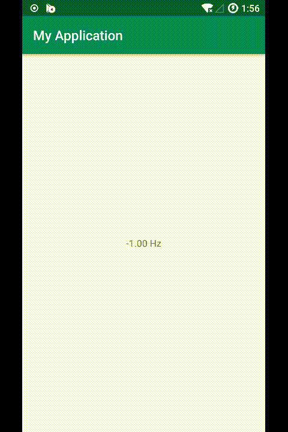

TarsosDSP on Android
=== 

[](https://jitpack.io/#axlecho/TarsosDSP)

The project is port from [JorenSix/TarsosDSP](https://github.com/JorenSix/TarsosDSP) for android

[sample](https://github.com/axlecho/TarsosDSP/releases/download/v3.0.0/sample.apk)

SnapShot
--


Usage
---
With Gradle:

*   Step 1. Add the JitPack repository to your build file
Add it in your root build.gradle at the end of repositories:
```
allprojects {
    repositories {
        ...
        maven { url "https://jitpack.io" }
    }
}
```
*   Step 2. Add the dependency
```
implementation 'com.github.axlecho:TarsosDSP:{last version}'
```

*	Step 3. Start activity with file path

```java
    // request audio permissions
    AudioDispatcher dispatcher = AudioDispatcherFactory.fromDefaultMicrophone(22050,1024,0);
    
    PitchDetectionHandler pdh = new PitchDetectionHandler() {
            @Override
            public void handlePitch(PitchDetectionResult result,AudioEvent e) {
                    final float pitchInHz = result.getPitch();
                    runOnUiThread(new Runnable() {
                        @Override
                        public void run() {
                            TextView text = (TextView) findViewById(R.id.textView1);
                            text.setText("" + pitchInHz);
                        }
                    });                        
            }
    };
    AudioProcessor p = new PitchProcessor(PitchEstimationAlgorithm.FFT_YIN, 22050, 1024, pdh);
    dispatcher.addAudioProcessor(p);
    new Thread(dispatcher,"Audio Dispatcher").start();
```
